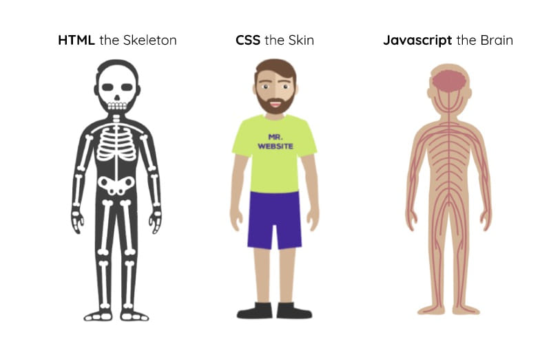

<b><h1 align="center"> WEBTEMBER - Session 1</h1></b>

07/Sep/2025 - Sunday<br>
Presenter: Sreenikethan Iyer

Table of contents:
1. [Introduction](#1-introduction)
2. [Components of a "Tech stack"](#2-components-of-a-tech-stack)
3. [Web dev concepts](#3-web-dev-concepts)
4. [Dev setup prerequisites](#4-dev-setup-prerequisites)
5. [Useful tips](#5-useful-tips)
6. [Project setup](#6-project-setup)


---


# **1. Introduction**

Welcome to the **Webtember Workshop Series**!

This hands-on workshop is designed to give participants a practical understanding of web development. By the end of the session, you'll have the skills to build your own portfolio website similar to [this example](https://webtembermtc.netlify.app/).

The workshop provides a **concise and practical briefing** on HTML, CSS, JavaScript, and React.js, helping you connect the dots and build a modern web application from scratch.

In this session, you will learn:

1. **Basics of HTML** - Understand the structure of a webpage using essential tags and elements.
2. **Basics of CSS** - Style your webpage effectively using selectors, properties, and layouts.
3. **Basics of JavaScript** - Add interactivity and dynamic behavior to your website.
4. **Introduction to React.js** - Learn how to integrate HTML, CSS, and JS into React components to build modern web apps.
5. **Version Control with Git & GitHub** - Set up your GitHub account, use basic Git commands, and share your project online.
6. **Development Environment Setup** - Install and use VS Code, and learn basic terminal commands essential for project development.

By the end of the workshop, you will be able to:

- Understand the **basic structure of a web page using HTML**.
- Style web pages effectively with **CSS**.
- Add interactivity using **JavaScript**.
- Build and understand **React.js components** and how HTML, CSS, and JS integrate.
- Set up **VS Code** and use the **terminal for development tasks**.
- Use **Git and GitHub** for version control and project sharing.
- Build and **deploy your own portfolio website**.


---


# **2. Components of a "Tech stack"**
A tech stack is the combination of all the technologies we use to build and run an entire application. Here, "stack" refers to the way these different technologies are "layered" on top of each other to create a complete application.

You can It includes the following aspects:
- Languages (HTML, CSS, JavaScript, [Python](https://python.org), …)
- Frameworks and libraries ([React](https://react.dev), [Angular](https://angular.dev), …)
- Databases ([MySQL](https://mysql.com), [PostgreSQL](https://postgresql.org), [MongoDB](https://mongodb.com), …)
- Tools
    - Version control - for tracking the history of your codebase, and revert any mistakes ([Git](https://git-scm.com), [GitHub](https://github.com), …)
    - Package managers - for installing libraries and frameworks ([npm](https://www.npmjs.com), [pip](https://pypi.org/), …)
    - Build tools and bundlers - for converting and optimizing your code into something that can run *fast* ([Vite](https://vite.dev), [Babel](https://babeljs.io), …)
- APIs
- etc…

The tech stack chosen for any given application can also be described using these components, each of which involve a combination of the technologies mentioned above. Here are the top 3 components that you can start learning about:

1. **Front-end a.k.a. Client-side**

    Client-side refers to the code and tech that runs on the users' devices. This component mainly deals with how your app is *presented* to the user, and this is what your user *interacts* with. Here's some scenarios for client-side software:
    - Instagram app on your phone
    - LMS website that you see on your laptop
    - The Telnet/SSH window that you see in your CP and OOPS labs

    The data for client-side software is usually received from the back-end.

2. **Back-end a.k.a. Server-side**

    Server-side refers to the code and tech that runs on a dedicated server. This component mainly deals with the "*business logic*" of your app and behind-the-scenes stuff. Here's some scenarios for server-side software:
    - The Instagram server in Meta's control
    - The game server that tells you about other players
    - The ChatGPT model software that runs on OpenAI's machines

3. **Databases**

    Anything which has to persist for a long time is stored in databases. The server-side software interacts with databases very closely. Here's some scenarios for databases:
    - Storing the Instagram posts and reels that you upload
    - Storing the courses that you are enrolled into
    - Storing your past conversations you've had with ChatGPT

Fun fact! A "full-stack" developer is someone who's capable of developing on both the front-end as well as the back-end.


---


# **3. Web dev concepts**

## *Some terms and words*
Here's some terms you'll come across very frequently:

1. **HTML:** Code used to describe the **structure** and **content** of your website. Think of it as the skeleton.
2. **CSS:** Code used to describe the **aesthetics** of your website.
3. **JS:** Code used to add functionality to the website. When you have some buttons on your website, you'd want them to *actually* do something, right? :)
4. **Framework vs. Library:** You'll hear these two terms a lot.
    - A Library (e.g., React) is a collection of pre-written code that you can call upon when you need it. It's like a toolkit; you're in charge and you pick the tools you need.
    - A Framework (e.g., Angular, Django) is a more rigid structure or blueprint for an application. It provides the scaffolding, and you build your code within its rules. The framework calls your code.
5. **Static page:** Websites where all the back-end does is to simply give the code files to the client, and there is **no database**. The server itself does not do any kind of significant processing. But keep in mind that the **client** can still be user-interactive with buttons and animations!
6. **Deployment:** The act of publishing your code to a back-end provider, and make it publicly available.

<p align="center">
<br />
(<a href="https://www.facebook.com/1499183006955896/">source</a>)
</p>

## *Tech stacks*
Now that you know what a "tech stack" is, let's explore the tech stack involved in web development.

1. **Front-end**

    For web development, the front-end here is in most cases your **web-browser**, like Google Chrome, Mozilla Firefox, etc. The web browser handles the following tasks:
    - Requesting the server for the webpage's HTML, CSS, JS code
    - Visually rendering the HTML, CSS, JS code to you, the user

2. **Back-end**

    For web development, there are so many options for back-end, so there isn't one "definite" choice here. The back-end performs these roles:
    - Listen for clients' requests using the HTTP protocol (i.e. a HTTP server)
    - Do processing, such as fetching from database, compiling results, and formatting them
    - Respond to clients' requests with the code from HTML, CSS, JS files located on the server, including the resulting data generated in the previous step

Here's the popular tech stacks used for web development:

- **LAMP:** **L**inux (OS), **A**pache (HTTP server), **M**ySQL (database), **P**HP (the server-side programming language)
- **MERN:** **M**ongoDB (database), **E**xpress.js (a back-end framework), **R**eact (a front-end JavaScript library), and **N**ode.js (the server-side runtime environment)

> [!NOTE]
> In this workshop, we'll be building a **static page portfolio**. The server itself does not do any kind of processing.
> For this reason, there are many popular hosting provides that give static page hosting for free. Examples:
> - GitHub Pages
> - Netlify
> - Vercel


---


# **4. Dev setup prerequisites**
Before you can start writing code, you need to set up your development environment.

1. **The Code Editor**

    A code editor is a specialized text editor designed for writing software. While you could technically write code in Notepad, a proper code editor provides features that are essential for modern development. **Visual Studio Code** (VS Code) is the most popular choice in the industry, since it's free and it has a massive ecosystem of extensions. Download it [here](https://code.visualstudio.com/download).

    **Workspace:** It's one of the most critical concepts of VS Code. It gives you the following benefits:
    - You get a file tree view on the side, showing every file and folder in your project.
    - You get smarter autocomplete ("IntelliSense"). It can suggest variable names, function definitions, and import paths from other files in your project.
    - You can search for anything across every single file in your project instantly.
    - VS Code includes a built-in **terminal** that automatically starts in your project's root folder, so you can run commands like `git` or `npm` in the same window.

    **Extensions** are add-ons that enhance VS Code's functionality. They add support for languages, help you format your code consistently, catch errors before you even run the code, and automate repetitive tasks. Here's some useful ones:
    - **Prettier:** An automatic code formatter that keeps your code style consistent.
    - **ESLint:** Analyzes your JavaScript and highlights potential errors or bad patterns.
    - **Live Server:** Instantly launches a local development server and reloads the page automatically whenever you save a file.

2. **Version Control: Git & GitHub**

    Version control is a system that tracks changes to your files over time. It's like a "save" button for your entire project, allowing you to go back to any previous version.

    **Git vs. GitHub:**
    - **Git** is the actual version control software that runs on your computer. It does the work of tracking changes and history.
    - **GitHub** is a web-based platform (now owned by Microsoft) that hosts your Git repositories. It's where you store your code remotely (in the cloud). It adds a collaborative layer on top of Git, with features for teamwork, issue tracking, and more. (Alternatives include GitLab and Bitbucket).


---


# **5. Useful tips**
1. Ensure you're in the correct folder before you run a command.

2. Here's some good practices for making *useful* commits:
    1. **Make Small, "Atomic" Commits:** Each commit should be a single, logical change. For example, a commit to "Add user login form" is much better than a huge commit that "Fixed bugs, added features, and updated styling."
    2. **Write Clear Commit Messages:** Your future self (and your teammates) will thank you. A good commit message briefly explains *what* the change is and *why* you made it. Use "Fix login bug" instead of "made some changes bruh lmao idk"
    3. **Commit Often:** Don't wait until the end of the day. Frequent commits create a detailed history of your project's progress.


---


# **6. Project setup**
Follow the steps below to set up your development environment and start building your portfolio website:

1. **Install Visual Studio Code (VS Code)**
   - Download: [https://code.visualstudio.com/](https://code.visualstudio.com/)
   - Recommended Extensions: Live Server, Prettier, ES7+ React/Redux/React-Native snippets

2. **Install a modern web browser**
   - Google Chrome: [https://www.google.com/chrome/](https://www.google.com/chrome/)
   - Mozilla Firefox: [https://www.mozilla.org/firefox/](https://www.mozilla.org/firefox/)

3. **Install Git and create a GitHub account**
   - Git: [https://git-scm.com/downloads](https://git-scm.com/downloads)
   - GitHub: [https://github.com/join](https://github.com/join)

   **Basic Git Commands:**
   ```bash
   git init               # Initialize Git repository
   git clone <repository> # Clone a repository
   git status             # Check Git status

4. **Install Node.js and npm**
    Download: [https://nodejs.org/en/download/]([https://nodejs.org/en/download/])
    Check Installation:
    ```shell
    node -v
    npm -v
    ```

5. **Use the Terminal / Command Line**
    - Windows: Command Prompt or Git Bash
    - macOS/Linux: Built-in Terminal

    Useful Commands:
    ```shell
    cd <folder_name>    # Navigate directories
    mkdir <folder_name> # Create a new folder
    ```

6. **Create a React App**

    ```shell
    cd <your-project-folder>          # Navigate to your project folder
    npx create-react-app my-portfolio # Create a new React app
    cd my-portfolio                   # Navigate into the project
    npm start                         # Start the development server
    ```

    React Documentation: [https://reactjs.org/docs/getting-started.html](https://reactjs.org/docs/getting-started.html)

7. **Install and Configure Tailwind CSS**

    ```shell
    cd my-portfolio
    npm install -D tailwindcss postcss autoprefixer
    npx tailwindcss init -p
    ```

    This is your Tailwind CSS config file. It tells Tailwind which files to scan and allows customization.
    ```js
    /** @type {import('tailwindcss').Config} */
    module.exports = {
    content: [
        "./src/**/*.{js,jsx,ts,tsx}",
    ],
    theme: {
        extend: {},
    },
    plugins: [],
    }
    ```

    **Add Tailwind directives to src/index.css:**
    ```css
    @tailwind base;
    @tailwind components;
    @tailwind utilities;
    ```

    **Start the project:**
    ```shell
    npm start
    ```

    Tailwind Documentation: [https://tailwindcss.com/docs/installation](https://tailwindcss.com/docs/installation)
